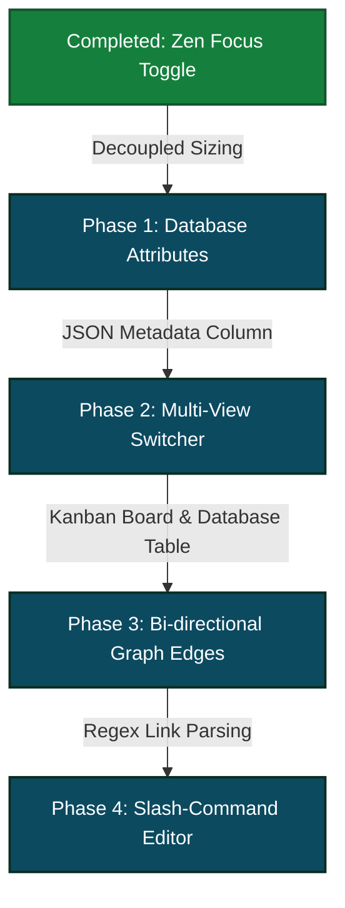

# 🛰️ Stratos vs. Nuclino: Feature Gap & Architecture Analysis

This document provides a highly structured, objective comparison between **Stratos** (your offline-first cognitive mind-map engine) and **Nuclino** (the industry-standard collaborative wiki & card system). It tracks feature comparisons, architectural gaps, and successfully completed roadmap milestones.

---

## 📊 High-Level Comparison Matrix

| Capability | Stratos (Current State) | Nuclino | Actionable Gap for Stratos |
| :--- | :---: | :---: | :--- |
| **Symmetrical Node Graph** | 🌌 **Advanced** (3D/2.5D GL Symmetrical views) | ⚠️ Basic (Simple 2D node map) | *Stratos wins on pure aesthetics and dynamic spatial modeling.* |
| **Zen Focus & Graph Toggle** | ✅ **100% Immersive Full-Screen & 50% Split Modes** | ❌ Hard-coded split/sidebar structures | *Stratos now enables full Zen focus with spring animations.* |
| **Multi-View Switcher** | ❌ Tightly coupled workspace views | ✅ **List, Board (Kanban), Table, Graph** | Need a single data structure toggled between views. |
| **Cross-Note Hyperlinking** | ❌ Parent-child hierarchy only | ✅ **Bi-directional linking (`@` / `[[`)** | Need to parsing editor links and draw graph edges dynamically. |
| **Custom Fields / Attributes** | ❌ Fixed schema (Title, Content) | ✅ **Metadata attributes (Status, Due Date, Owner)** | Add a JSON-metadata field to notes for custom columns. |
| **Rich Slash Editor** | ⚠️ Basic WYSIWYG Markdown | ✅ **Slash commands (`/`) & instant widgets** | Upgrade editor to support slash commands for embeds. |
| **Data Sovereignty / Speed** | 🚀 **Local SQLite + Dexie Sync (Sub-10ms)** | ❌ Cloud-only | *Stratos wins on privacy, offline resilience, and speed.* |

---

## 🔍 Deep-Dive Gap Analysis & Completed Milestones

### 🟢 [COMPLETED MILESTONE] Decoupled Zen Focus Mode (50% / 100% Flex Toggle)
*   **The Issue:** Previously, the editor panel was rigidly bound to a 50% split-pane next to the graph, resulting in visual crowding during long-form note writing and cognitive friction.
*   **The Solution:** Implemented a high-speed double-arrow icon toggle in the `NotesEditor` header. Users can seamlessly scale the workspace width from **50% to 100% with fluid spring-physics transitions**, temporarily sliding the Node Graph out of view for uninterrupted zen focus, with absolute zero loss of draft or cursor state!

### 1. Unified Multi-View Toggle (Board & Table Views)
In Nuclino, every workspace is a database. You can view the exact same data as a **Hierarchical List**, a **Kanban Board** (grouped by columns), a **Structured Spreadsheet Table**, or a **Graph Map**. 
*   **Stratos's Gap:** While we have a premium visual Graph, a Notes list, and an Editor, we lack a **Kanban Board View** and a **Database Table View**.
*   **How to Bridge:** We can add a "View Switcher" header widget on the overview tab, allowing the active workspace's note list to render as draggable Kanban cards (using simple Drag-and-Drop) or as a structured table with editable cells.

### 2. Bi-Directional Cross-Linking (`[[Note Name]]` or `@`)
In Nuclino, typing `@` or `[[` inside the editor displays a dropdown of all other notes. Selecting one inserts an internal hyperlink. When done, **Nuclino dynamically draws a connection line (edge) between these two notes in the Graph View!**
*   **Stratos's Gap:** Currently, Stratos's graph lines are determined strictly by parent-child relations (Workspace ➔ Cluster ➔ Note). If Note A is inside Cluster A, and Note B is inside Cluster B, there is no way to connect them visually.
*   **How to Bridge:** We can write a regex parser in our markdown editor that scans note content for internal links like `[[note-id]]`. We then feed these parsed links to our GraphView as auxiliary edges, drawing glowing cross-cluster connections!

### 3. Custom Metadata Fields & Columns
Nuclino allows users to assign attributes to notes:
*   `Status` (To Do, In Progress, Review, Done)
*   `Priority` (High, Medium, Low)
*   `Due Date`
*   `Assignee`
*   **Stratos's Gap:** Our `notes` database table schema is statically limited to `id`, `title`, `content`, `parent_id`, and `workspace_id`.
*   **How to Bridge:** We don't need to rebuild our SQLite/Dexie schema! We can simply add a single `attributes_json` column to the `notes` table. This allows us to store arbitrary, extensible user-defined fields on any note without complex database migrations.

### 4. Interactive Editor Slash Commands (`/`)
Nuclino's editor feels like magic because typing `/` opens an instant widget selector to embed checklists, code blocks, tables, images, or files.
*   **Stratos's Gap:** Our editor is a clean classic textarea/markdown wrapper.
*   **How to Bridge:** We can integrate a slash-command listener on the React text input. Typing `/` displays a floating glassmorphic tooltip listing markdown templates (e.g., `/todo` inserts `[ ] `, `/code` inserts ` ``` `, `/table` inserts a markdown table grid).

---

## 🗺️ Architectural Evolution Roadmap (Stratos)



> [!NOTE]  
> Because Stratos is built on an **offline-first local-speed architecture** (SQLite + Dexie), implementing these features will make Stratos significantly faster and more private than Nuclino, turning it into a sovereign personal thinking machine.
